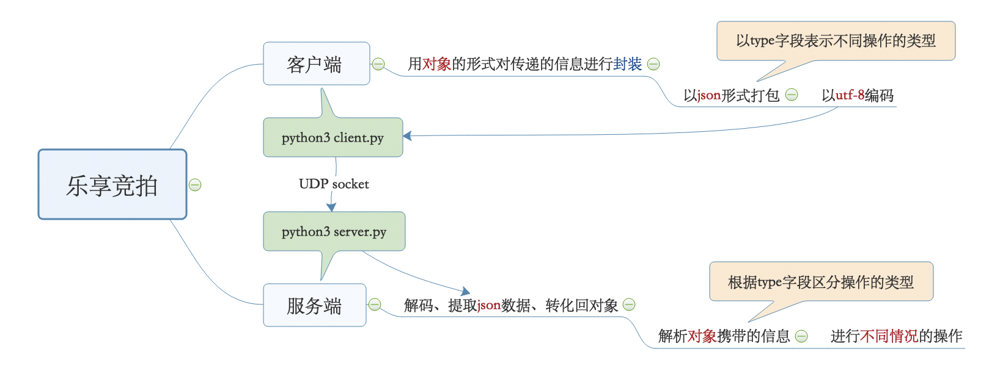
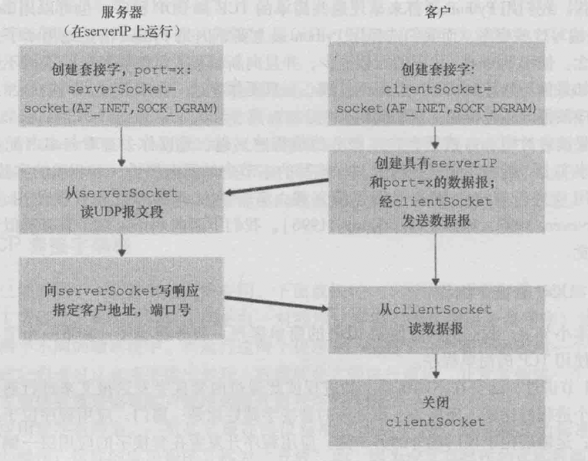
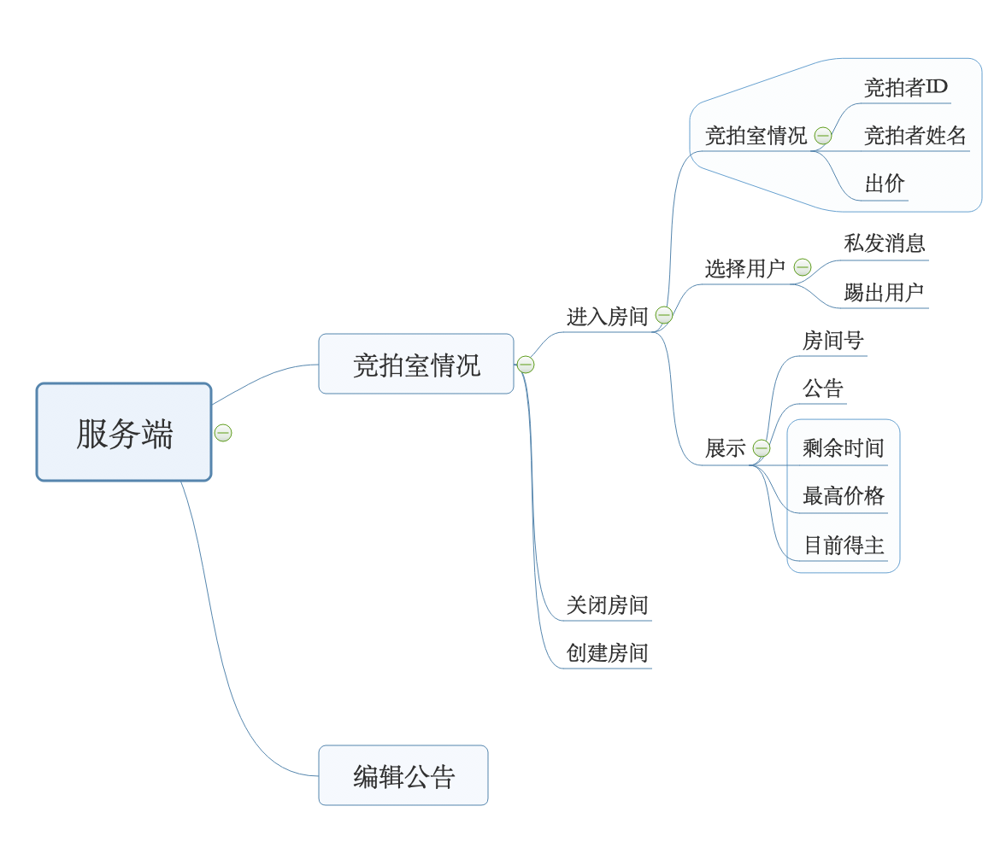
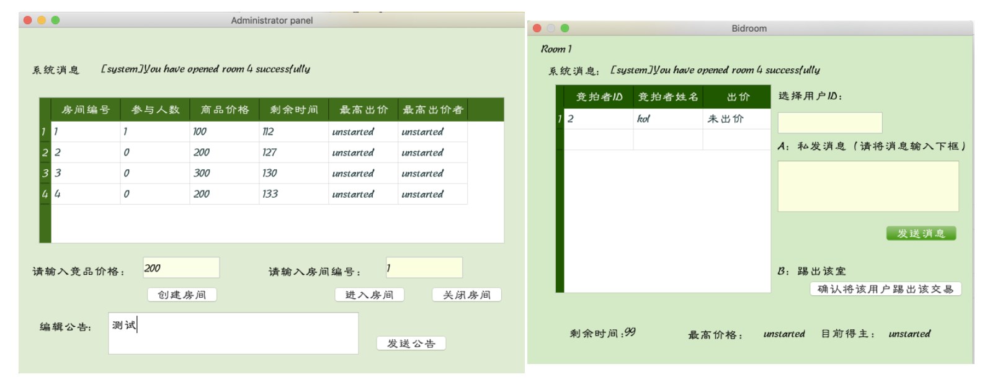
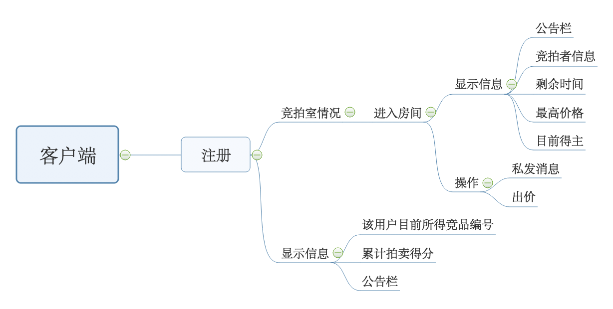
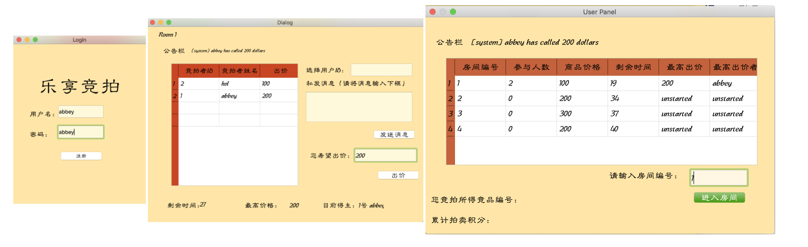

# README

[TOC]


### 项目简介

[设计文档&用户手册pdf](file&usermanual)

本项目设计了一个**基于UDP**的网络拍卖行程序，包含客户端和服务端。**使用语言：python3；UI设计：pyqt5；采用多线程**。

- 服务端，也即管理员端，支持对竞拍室的情况进行查看、操作（开通、关闭）、发布消息（公告、私聊）、踢出用户等等关键管理操作。
- 客户端，也即用户端，支持注册、选定竞拍室参与竞拍、喊价、发送私聊信息、累计积分等等关键竞拍操作。

总体而言，项目框架较清晰，功能可拓展性较强（与传递消息的处理方式有关）。

因每个服务端、客户端占用一个端口，故服务端、客户端均支持**多个同时在线**，且同一个服务端支持大规模用户同时在线。

### 可执行文件操作

运行`./exe/dist`中的两个文件即可，客户端可以点击`client`运行多个。

### 源代码执行操作

运行操作，在`./sourcecode`目录下：

- 首先，运行服务端：

  ```python
  python3 server.py
  ```

  默认服务器ip地址`127.0.0.1`，端口`8093`

- 其次，运行客户端：

  ```python
  python3 client.py
  ```

  默认客户端最初ip地址`127.0.01`，端口`2227`。每打开一个新的窗口，端口数自动加一，如果冲突（执行失败）则继续加一。

# 「乐享竞拍」——基于UDP的网络拍卖行程序的设计文档

何千羽 17300240016

## 1. 引言

### 1.1 项目简介

本项目设计了一个**基于UDP**的网络拍卖行程序，包含客户端和服务端。**使用语言：python3；UI设计：pyqt5；采用多线程**。

- 服务端，也即管理员端，支持对竞拍室的情况进行查看、操作（开通、关闭）、发布消息（公告、私聊）、踢出用户等等关键管理操作。
- 客户端，也即用户端，支持注册、选定竞拍室参与竞拍、喊价、发送私聊信息、累计积分等等关键竞拍操作。

总体而言，项目框架较清晰，功能可拓展性较强（与传递消息的处理方式有关）。

因每个服务端、客户端占用一个端口，故服务端、客户端均支持**多个同时在线**，且同一个服务端支持大规模用户同时在线。

运行操作，在`./sourcecode`目录下：

- 首先，运行服务端：

  ```python
  python3 server.py
  ```

  默认服务器ip地址`127.0.0.1`，端口`8093`

- 其次，运行客户端：

  ```python
  python3 client.py
  ```

  默认客户端最初ip地址`127.0.01`，端口`2227`。每打开一个新的窗口，端口数自动加一，如果冲突（执行失败）则继续加一。

### 1.2 项目结构

以客户端向服务端发送数据为例，服务端向客户端发送数据同理。



1.3 技术术语

- `UDP`：“最简约的”Internet运输协议，仅提供最低限度运输层服务：提供运输层的多路复用与多路分解、轻型的差错检测。不提供拥塞控制、不建立连接、无连接状态。因此较TCP有以下优点：（1）对发送数据的应用层控制更精细（2）不引入建立连接时延（3）支持更多的活跃客户（4）分组首部开销小，在网络稳定的情况下分组很少丢失。故本程序基于UDP协议。

- `socket`：套接字是同一台主机内应用层和运输层之间的接口，两个进程彼此之间通过向套接字发送报文进行通信。逻辑大致如下图：

  

- `Pyqt`：PyQt是Python语言的GUI编程解决方案之一。PyQt的文档比[PyGTK](https://zh.wikipedia.org/wiki/PyGTK)、[wxPython](https://zh.wikipedia.org/wiki/WxPython)、[Tkinter](https://zh.wikipedia.org/w/index.php?title=Tkinter&action=edit&redlink=1)等GUI编程库的文档丰富得多。

### 1.4 文件结构

```c
.
├── sourcecode								#源代码，在该文件目录下运行
│   ├── __pycache__
│   ├── server.py							#管理员主文件：建立socket，联系所有server端的UI
│   ├── server_room.py				#管理员UI主界面：展示所有竞拍室的情况，包含对所有竞拍室的关键操作
│   ├── specificroom.py				#竞拍室UI：展示某一竞拍室的竞拍情况，包含对该竞拍室的所有竞拍者的关键操作
│   ├── client.py							#用户主文件：建立socket，联系所有client端的UI
│   ├── login.py							#用户注册UI
│   ├── bidroom.py						#竞拍室UI：展示某一竞拍室的竞拍情况，包含参加竞拍的关键操作
│   └── usermain.py						#用户UI主界面：展示所有竞拍室的情况，包括关键操作
└── ui												#UI代码，仅作提交，无需包含该目录运行
    ├── server_ui							#服务器UI源代码，略，仅作提交，运行时不需考虑
    └── user_ui								#用户UI源代码，略，仅作提交，运行时不需考虑
```

## 2. 设计思路与实现过程

这部分将以1.2部分的项目结构为主要思路，以关键代码作为示例，对实现过程进行阐释。

### 2.1 服务端

主要功能框架图如下：



对应关键UI（详细UI将在用户手册中展示）：



#### 2.1.1 线程

服务端主要有五个线程，目的分别为：

- `主线程`：管理员通过点击进行操作

- `receive`：监听子线程传来的消息
- `refresh_time`：相当于系统的时钟，每秒将每个房间的剩余时间减1（每个房间初始默认200秒）
- `refresh*2`：两个UI界面，每秒更新一次所有动态的UI，包括表格、系统公告、剩余时间、最高价格、目前得主的标识

以`refresh_time`为例，建立线程的代码如下：

```python
        #Thread as Clock
        t1 = threading.Thread(target=self.refresh_time)
        t1.setDaemon(True)
        t1.start()
```

#### 2.1.2 消息接收

##### a. 建立socket，循环监听

- 默认服务器ip地址`127.0.0.1`，端口`8093`

  ```python
      localhost = '127.0.0.1'
      localport = '8093'
      localaddr = (localhost,int(localport))
  ```

- 建立socket

  ```python
          sock = socket(AF_INET, SOCK_DGRAM)
          sock.bind(localaddr)
  ```

- while循环，持续监听端口接收子进程发来的信息

  ```python
          while True:
              msg, addr = sock.recvfrom(8192)
  ```

##### b. 接收数据，进行解码，分类操作

- 接收到的为`json`形式的数据，进行拆解，获得`object`格式的数据

  ```python
              msg = json.loads(msg)
  ```

- 通过`handle`函数对该`object`进行解析。`handle`函数可以说是最重要的函数，它将所有的函数串联起来，对用户的不同操作进行分类，而操作的类型由`object`中`type字段`进行区分。因此可以看见，**这种消息处理方法使项目功能的可拓展性极强。**

  ```python
      #handler for operation from client
      def handle(self,msg,addr):
          '''
          消息接收处理器
          '''
          if self.auth(msg["auth"],addr): #如果用户名合法
              if msg["type"]=="notice":		#当用户进入系统，通知所有的用户
                  text = (self.userList[msg["auth"]["name"]]["bidderID"] + "号 "+msg["auth"]["name"]+" " + "上线")
                  self.boardcast(text)
              elif msg["type"]=="auction":#当用户进入某个竞拍室，通知该竞拍室所有的用户
                  text = '[+]enter new auction\n'
                  rmID = int(msg["rmID"])
                  self.enterroom(rmID,msg["auth"],addr)
              elif msg["type"]=="leave":  #当用户离开某一竞拍室，通知该竞拍室所有的用户
                  rmID = int(msg["rmID"])
                  self.leaveroom(rmID,msg["auth"],addr)
                  self.renewhighest(rmID)    
                  #...以下省略
  ```

#### 2.1.3 消息发送

##### a. 分类标识，打包数据，进行编码

发送数据与接收数据同理。msg为`object`类型，其中`type`字段表明操作的类型。

```python
    #pack msg
    def pack(self,msg):
        msg = json.dumps(msg)								#封装为json数据包
        msg = bytes(msg, encoding='utf-8')	#以utf-8编码
        return msg
```

##### b .建立socket，发送

```python
    #Send msg
    def send(self,msg,addr):
        '''
        发送消息
        '''
        s = socket(AF_INET, SOCK_DGRAM)
        s.sendto(msg, addr)
```

#### 2.1.4 主要结构

##### a. bidroom

 类型为对象，以房间号为索引，主要字段如下：

```python
        room = {}
  			room['buyersnum'] = 0									#该房间的竞拍人数
        room['buyers'] = []										#参与该房间竞拍的用户的名称
        room['price'] = price									#该竞拍室中的竞拍物品价钱
        room['time'] = 200										#默认竞拍200秒
        room['highest'] = 'unstarted'					#最高的竞拍价格
        room['highestbuyer'] = 'unstarted'		#目前竞拍得主
```

所有`bidroom`组成`roomList`数组。

##### b. user

类型为对象，以用户名称为索引（重复的用户名无法注册），主要字段如下：

```python
        self.userList[auth["name"]] = {}
        self.userList[auth["name"]]["addr"] = addr									#该用户的socket套接字地址（IP地址，端口号）
        self.userList[auth["name"]]["pwd"] = auth["pwd"]						#密码
        self.userList[auth["name"]]["room"] = -1										#正处的竞拍室（只能有一个）
        self.userList[auth["name"]]["bidderID"] = str(self.bidderID)#唯一的bidderID
        self.userList[auth["name"]]["givenprice"] = -1							#目前喊价
        self.userList[auth["name"]]["owing"]= []										#得到的竞拍物品
        self.userList[auth["name"]]["mark"]= 0											#竞拍积分（每一美元一分）
```

所有`user`组成`userList`数组。

### 2.2 客户端

主要功能框架图如下：



对应关键UI（详细UI将在用户手册中展示）：



传递消息逻辑与服务端类似，不在此赘述。

默认客户端最初ip地址`127.0.01`，端口`2227`。每打开一个新的窗口，端口数自动加一，如果冲突（执行失败）则继续加一。

```python
    localHost = '127.0.0.1'
    localPort = 2227
    localAddr = (localHost,int(localPort))

    romoteHost = '127.0.0.1'
    romotePort = '8093'
    romoteAddr = (romoteHost,int(romotePort))
    while True:
        try:
            client = Client(localAddr,romoteAddr)
            break
        except:
            localPort = localPort+1
            localAddr = (localHost,int(localPort))
```

关键操作为通过循环获取服务端的关键变量，从而对数据进行更新：

```python
    def getList(self):
        while True:
            time.sleep(1)
            msg = {}
            msg["type"] = "List"
            self.send(msg)
            # print(msg)
```

服务端发送关键变量：

```python
    #send certain info to every client
    def sendList(self,msg,addr):
        msg = {}
        msg["type"] = "roomList"
        msg["roomList"] = self.roomList
        msg["userList"] = self.userList
        msg["roomID"] = self.roomID
        msg = self.pack(msg)
        self.send(msg,addr)
```

## 3. 未来改进与项目收获

因为时间因素，部分想法未实现。如有机会，会从以下方面进行改进：

- 增加安全性：为了代码方便，服务端将关键的变量`userList`、`roomList`等均发送给了所有的客户端，这事实上是非常不安全的，因为包含了所有管理员可以接触的信息，包括用户的密码
- 加强容错性：判断输入类型是繁杂的，由于时间因素后期放弃了判断输入的合法性以及是否会造成bug。对于一个良好的系统来说，容错性很重要。
- 加入数据库：竞品信息、用户信息均可以存入数据库，例如mongoDB
- 增加功能：已有功能已经积攒一定的数据量，可以进行一系列的排序、分析和展示，例如竞拍积分等等；管理员方面也可以增加更多功能，例如用户管理等等。
- 尝试用TCP实现可靠的数据传输。

对于项目收获，本项目虽然看起来关键思想较易理解，也即`socket编程`、数据传递的方法、多线程编程，但是工作量其实较大。因为实现的**功能数量较多**，导致变量多、用户和服务端之间传递的数据量大，尤其是加上UI展示后，很容易因为一时疏漏而报错。因此若说项目收获，总结如下：

- 更进一步了解了socket编程，并了解多种类信息的传递如何处理较清晰并拥有可拓展性
- 见识了多线程编程的力量
- 新学习了功能强大的pyqt，巩固了python语言
- 加强了编程能力

## 参考文献

- https://github.com/fatliau/ChatRoom_ClientServer （原文使用的TCP协议，本项目参考了pyqt5与代码结合的方式）
- https://github.com/MKI603/Python-ChatRoom （原文没有UI功能，本项目借鉴了利用UDP传递消息的方式）